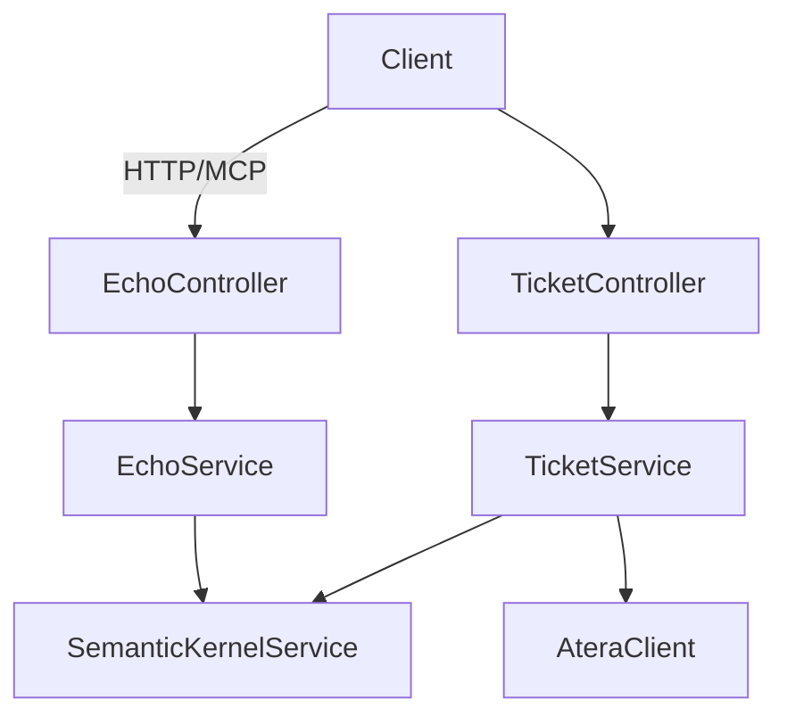

## About Project

This project is to convert .NET8/MCP SDK project copied from Planner MCP server 
into .NET 9 porject for Atera API ticket management MCP server.
PlannerMcp has a fully working Echo 101 MCP tool.
Eventually we will convert this PlannnerMCP MCP server into Atera MCP server for Atera API.


## To Do

Below is the detailed implementation roadmap for evolving this repo from a .NET 8 proof-of-concept into a production-ready .NET 9 Atera MCP server.

### 1️⃣  Short-Term Goals (MVP)
- [ ] Green-field integration test proving the Echo 101 MCP tool can **start ➜ initialise ➜ respond**  
  - Command: `dotnet test --filter "Category=Integration"`
- [ ] Basic logging via **Microsoft.Extensions.Logging**
- [ ] Port solution & projects to **.NET 9.0-preview**
- [ ] Continuous Integration pipeline with `dotnet restore`, build, and test using GitHub Actions.

### 2️⃣  Mid-Term Goals
- [ ] Implement `Tickets.Get`, `Tickets.Create`, `Tickets.UpdateStatus` Atera endpoints
- [ ] Dockerfile and GitHub Actions release workflow
- [ ] End-to-end tests against Atera sandbox API

### 3️  Mid-Term Goals
- [ ] Error handling

### CRC Cards

| Class | Responsibilities | Collaborators |
|-------|------------------|---------------|
| `Program` | Wire up DI container, host configuration, start web host | `Startup` |
| `Startup` | Register services, middlewares, MCP tool routes | `Program`, `EchoController`, `TicketController` |
| `EchoController` | HTTP/MCP endpoint `/echo` -> validates request -> calls service | `EchoService` |
| `EchoService` | Core echo logic, transformation, telemetry | `EchoController` |
| `TicketController` | MCP endpoints for ticket operations | `TicketService` |
| `TicketService` | Talks to **Atera REST API**, performs business rules | `TicketController`, `AteraClient` |
| `AteraClient` | Low-level HTTP wrapper for Atera API with resiliency | `TicketService` |
| `SemanticKernelService` | Hosts SK planners & skills | `TicketService`, `EchoService` |

---

### Navigation Map



---

### Example Call Stack (to-be)

1. **MCP Request** `POST /echo`  
   Parameters: `message: string`
2. `EchoController.EchoAsync(message)`
3. `EchoService.EchoAsync(message)`
4. `SemanticKernelService.RunSkillAsync("reflect", message)`
5. `EchoService.MapResponse(kernelResult)`
6. `EchoController.Ok(response)`

All parameters bubble through exactly once; all methods are **async** and return `Task<T>`.

---

### Testing Strategy (T-DD starting point)

- Create failing test `EchoTool_Should_ReturnSameText`
- Implement minimal code to pass
- Refactor & add edge-case table-driven tests

### 3rd Party Dependencies

**Semantic Kernel (SK):**  
[https://github.com/microsoft/semantic-kernel](https://github.com/microsoft/semantic-kernel)

**MS MCP SDK:**  
[https://github.com/modelcontextprotocol/csharp-sdk](https://github.com/modelcontextprotocol/csharp-sdk)

### Working MCP Server Config Examples

Note: `--no-build` flag is required, otherwise connection errors may occur.

```json
"PlannerMcp": {
  "command": "dotnet",
  "args": [
    "run",
    "--project",
    "C:\\Work\\Projects\\Planner-Mcp\\PlannerMcp\\PlannerMcp.csproj",
    "--no-build"
  ],
  "disabled": false,
  "autoApprove": [],
  "debug": true,
  "options": {
    "shell": true,
    "cwd": "C:\\Work\\Projects\\Planner-Mcp"
  },
  "env": {
    "DOTNET_ENVIRONMENT": "Development"
  }
},
"PlannerMcp-minimal-working-config": {
  "command": "dotnet",
  "args": [
    "run",
    "--project",
    "C:\\Work\\Projects\\Planner-Mcp\\PlannerMcp\\PlannerMcp.csproj",
    "--no-build"
  ]
}